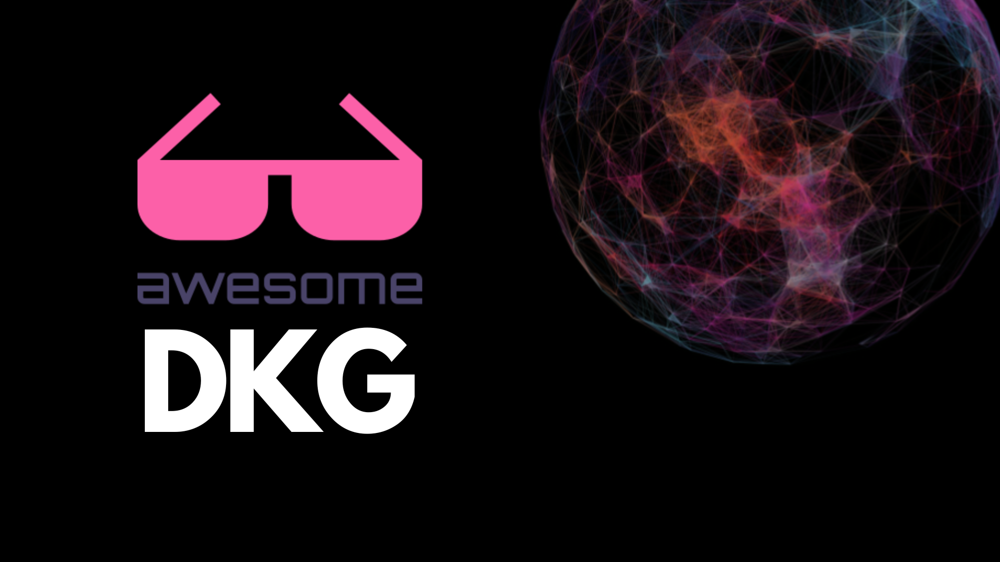

# Awesome DKG (Decentralized Knowledge Graph) 

 A curated list of awesome resources, tools, and projects related to the OriginTrail Decentralized Knowledge Graph (DKG).

    

 OriginTrail Decentralized Knowledge Graph (DKG) presents a global, open data structure comprised of interlinked knowledge assets, structured in a RDF knowledge graph, hosted on an open, permissionless decentralized network of DKG nodes. It's designed to support [the Verifiable Internet for AI](https://origintrail.io/ecosystem/whitepaper) on the basis of an open, permissionless knowledge economy in which knowledge is the primary asset class.

---

## Contents

- [Documentation](#documentation)
- [Implementation](#implementation)
- [Documentation](#documentation)
- [SDKs and Libraries](#sdks-and-libraries)
- [Tools](#tools)
- [Interaction](#interaction)
- [Applications](#applications)
- [Tutorials](#tutorials)
- [Community](#community)
- [Contributing](#contributing)

## Documentation

- [OriginTrail Documentation](https://docs.origintrail.io/) - Official documentation
- [OriginTrail Deep Dive](https://deepdive.othub.io/)
- [OriginTrail RFCs repository](https://github.com/OriginTrail/OT-RFC-repository/)
- [OriginTrail Whitepapers](https://origintrail.io/ecosystem/whitepaper)
- [DKG Paranets repository](https://github.com/OriginTrail/dkg-paranets) - Dedicated repository for DKG Paranets and IPOs preparation
- [Knowledge mining on NeuroWeb](https://docs.neuroweb.ai/knowledge-mining)

## Implementation

- [OT-Node](https://github.com/OriginTrail/ot-node) - OriginTrail DKG node implementation
- [DKG Smart contracts](https://github.com/OriginTrail/dkg-evm-module) - Solidity implementation of DKG Incentivization layer

## SDKs and Libraries

- [dkg.js](https://www.npmjs.com/package/dkg.js) - JavaScript SDK for interacting with the DKG.
- [dkg.py](https://github.com/origintrail/dkg-python) - Python SDK for interacting with the DKG.
- [Dev3 SDK](https://github.com/0xDev3/dev3-sdk/tree/master) - TypeScript SDK for DKG and blockchain Low-Code App Devlopment and Automation
- [DkgAzureFunctionPublic](https://github.com/Collabwriting/DkgAzureFunction) - A simple Azure Function API for interacting with DKG
- [NatLangKG](https://github.com/DarrenZal/NatLangKG) - AI-Enhanced Semantic Interfacing for DKG
- [assertion-tools](https://github.com/OriginTrail/assertion-tools) - Common assertion tools used in DKG

## Tools

- [Houston](https://houston.origintrail.io/) - Node command center
- [Knowledge assets distribution simulation](https://github.com/OriginTrail/ot-node/tree/v6/develop/tools/knowledge-assets-distribution-simulation) - Visualization tool that displays distribution of Knowledge Assets on DKG
- [Local network setup tool (MacOS, Linux)](https://github.com/OriginTrail/ot-node/tree/v6/develop/tools/local-network-setup) - Setup tool to run DKG in your local environment
- [othub-sync](https://github.com/othub-io/othub-sync) - Python-based repository that fetches blocks, transactions and events data for select DKG smart contracts from the blockchains and stores it in a local database

## Interaction

- [DKG Explorer](https://explorer.origintrail.io) - A tool to explore and visualize the DKG
- [nOS](https://origintrail.io/products/network-operating-system) - OriginTrail Network Operating System (nOS)
- [othub-bot](https://github.com/othub-io/othub-bot) - Telegram bot  to view advanced DKG statistics and to create Knowledge Assets 
- [OTHub.io](https://www.othub.io/) - advanced network statistics for the DKG and tools for network participants to interact with the ecosystem

## Applications

- [ChatDKG.ai](https://chatdkg.ai/) - Open framework for trusted AI based on OriginTrail DKG
- [Polkabot.ai](https://polkabot.ai/) - Trusted AI-powered education on chain for Polkadot ecosystem
- [Chat with chicken](https://www.perutnina.com/int/en/premium-quality/check-the-origin/) - Trusted AI app to drive consumer interaction
- [Tracverse](https://www.tracverse.com) - A graph omniverse
- [DKG Copilot](https://github.com/sailingamigos/dkg-researcher-plugin) - AI-powered copilot plugin for scientific research
- [Collabmining](https://github.com/Collabwriting/TruthchainExtension) -  Chrome Extension that leverages Truthchain to verify information online and publish it to DKG
- [Trusted AI solutions overview](https://origintrail.io/solutions/overview) - Overview of all solutions on DKG

## Tutorials

- [Decentralized RAG with NVIDIA Build ecosystem](https://origintrail.io/blog/decentralized-rag-with-origintrail-dkg-and-nvidia-build-ecosystem)
- [Trusted AI solution with Chainlink Data Feeds](https://origintrail.io/blog/trusted-ai-for-next-generation-rwas-with-origintrail-and-chainlink)
- [Decentralized RAG with Google Gemini](https://origintrail.io/blog/decentralized-rag-101-with-origintrail-dkg-and-google-gemini)
- [Vertex AI integration](https://github.com/OriginTrail/ChatDKG/tree/main/examples/google-vertex-ai)
- [Integration with Langchain](https://github.com/OriginTrail/ChatDKG/tree/main/examples/langchain)
- [Extractive question answering with Milvus Vector Database](https://github.com/OriginTrail/ChatDKG/tree/main/examples/milvus)

## Community

- [Telegram Group](https://t.me/origintrail) - Join the conversation with the OriginTrail community
- [Discord Server](https://discord.com/invite/QctFuPCMew) - Chat with developers and contributors

## Contributing

Contributions are welcome! Please read the [contributing guidelines](CONTRIBUTING.md) before submitting new resources or tools.
